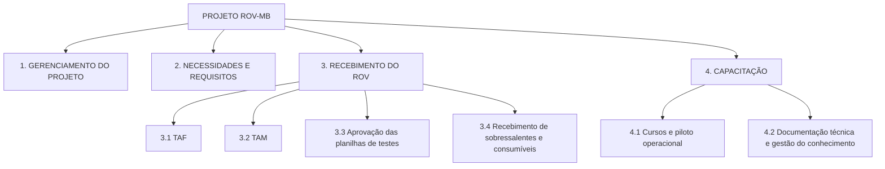

# Tarefa 2 — EAP e Dicionário da EAP · Versão revisada

**Projeto:** ROV-MB — Aquisição, Integração e Validação de um ROV Modular  
**Disciplina:** Curso GDP 2026 — Gerenciamento de Projetos · Gerenciamento de Escopo — Criação da EAP  
**Base:** Tarefa 1 (TAP) · críticas e decisões do orientador (Cmdt Huback) · Dez Mandamentos da EAP

> **Situação:** versão revisada após a orientação do Cmdt Huback. **Esta é a versão oficial (congelada) da EAP e do Dicionário**, utilizada como base da Tarefa 3.  
> **Versão original preservada sem alteração:** [`tarefas/Tarefa 02 - EAP e Dicionário.docx`](../tarefas/Tarefa%2002%20-%20EAP%20e%20Dicion%C3%A1rio.docx).

## Controle de versão

| Versão | Documento | Estrutura | Situação |
|---|---|---|---|
| Original | `tarefas/Tarefa 02 - EAP e Dicionário.docx` | 7 elementos de primeiro nível · 23 pacotes de trabalho | Histórico (não alterado) |
| Revisada | `entregas/tarefa-2-revisada.md` (e `.docx`) | 4 elementos de primeiro nível · 10 elementos · 8 pacotes de trabalho | Oficial — congelada |

## I — Enunciado do trabalho

O projeto ROV-MB tem por objetivo especificar, adquirir, integrar e validar um veículo submarino operado remotamente (ROV) modular, destinado à inspeção visual e à busca de objetos submersos pela Marinha do Brasil. O MVP será operado a partir de terra, por um militar especializado treinado, em água doce e salgada, com câmera e iluminação como núcleo funcional, dentro do envelope operacional aprovado (profundidade nominal de 10 m, máxima de 30 m, autonomia mínima de 2h30). A modularidade é requisito obrigatório da arquitetura, mesmo que os módulos adicionais (sonar, garra/manipulador) não integrem o MVP.

Foram elaborados os seguintes documentos para este projeto:

- EAP (versão revisada); e
- Dicionário da EAP (versão revisada).

## II — Estrutura Analítica do Projeto (EAP)



Representação textual:

```text
PROJETO ROV-MB
│
├── 1. GERENCIAMENTO DO PROJETO
│
├── 2. NECESSIDADES E REQUISITOS
│
├── 3. RECEBIMENTO DO ROV
│   ├── 3.1 TAF
│   ├── 3.2 TAM
│   ├── 3.3 Aprovação das planilhas de testes
│   └── 3.4 Recebimento de sobressalentes e consumíveis
│
└── 4. CAPACITAÇÃO
    ├── 4.1 Cursos e piloto operacional
    └── 4.2 Documentação técnica e gestão do conhecimento
```

| Código | Elemento | Nível | Tipo | Filhos |
|---|---|---|---|---|
| 1 | Gerenciamento do Projeto | 1 | Pacote de trabalho | — |
| 2 | Necessidades e Requisitos | 1 | Pacote de trabalho | — |
| 3 | Recebimento do ROV | 1 | Elemento de agregação | 3.1, 3.2, 3.3, 3.4 |
| 3.1 | TAF | 2 | Pacote de trabalho | — |
| 3.2 | TAM | 2 | Pacote de trabalho | — |
| 3.3 | Aprovação das planilhas de testes | 2 | Pacote de trabalho | — |
| 3.4 | Recebimento de sobressalentes e consumíveis | 2 | Pacote de trabalho | — |
| 4 | Capacitação | 1 | Elemento de agregação | 4.1, 4.2 |
| 4.1 | Cursos e piloto operacional | 2 | Pacote de trabalho | — |
| 4.2 | Documentação técnica e gestão do conhecimento | 2 | Pacote de trabalho | — |

Totais: 4 elementos de primeiro nível, 6 de segundo nível e 8 pacotes de trabalho (1, 2, 3.1, 3.2, 3.3, 3.4, 4.1 e 4.2).

## III — Dicionário da EAP

| Código na EAP | Pacote de trabalho | Especificação | Critério de aceitação |
|------|------------|------------------------------------------|------------------------|
| 1 | Gerenciamento do Projeto | Entrega de todas as práticas correlacionadas aos grupos de processo: iniciação, planejamento, execução, monitoramento e controle e encerramento em consonância com o preconizado no PMBOK. Abrange: a governança do projeto (papéis, responsabilidades e processo decisório, com submissão das decisões à Força de Submarinos) e a manutenção do TAP; o plano de gerenciamento do projeto, o cronograma de marcos e o orçamento; os registros de premissas, riscos, questões, decisões e mudanças, com controle integrado de mudanças e avaliação de desempenho; o plano de comunicação e o mapa de partes interessadas, com atas, oficinas e registro da participação dos Distritos e grupamentos; a integração entre usuários, engenharia, logística, testes e capacitação; a validação formal das entregas junto à autoridade de aprovação; e o encerramento do projeto — relatório final, aceite definitivo, transferência formal do pacote do projeto às organizações usuárias, lições aprendidas, recomendação de continuidade (inclusive quanto à integração de módulos futuros), arquivamento da documentação e encerramento administrativo. Os grupos de processo são práticas deste pacote e não constituem subpacotes. | Registros de gerenciamento (TAP, plano, cronograma de marcos, premissas, riscos, decisões e mudanças) mantidos atualizados e desempenho reportado à Força de Submarinos ao longo do ciclo de vida; encerramento aprovado formalmente pela Força de Submarinos, com pendências aceitas ou transferidas, lições aprendidas registradas e recomendação de continuidade emitida (TAP, seções 12, 13 e 15). |
| 2 | Necessidades e Requisitos | Entrega da linha de base de necessidades e requisitos do ROV-MB. Abrange: a necessidade operacional consolidada e o mapa de usuários (Distritos, grupamentos e militares especializados), com perfis de operadores e tarefas; o CONOPS e o envelope operacional — operação a partir de terra (cais ou margem) por um único operador, em água doce e salgada, preferencialmente em locais abrigados, profundidade nominal de 10 m e máxima de 30 m, limites de correnteza e rebojo, limite de visibilidade (com confirmação da interpretação do valor de 30 cm), preparação, operação, recuperação e cenários de emprego; os requisitos funcionais, ambientais, de imagem e vídeo, autonomia, umbilical, modularidade, segurança (comportamentos de proteção), manutenção, sobressalentes, treinamento e ciclo de vida; a arquitetura modular — núcleo, interfaces, configuração do MVP (câmera e iluminação, sem sonar e sem garra/manipulador) e aparatos para expansões futuras; e os critérios de aceitação do produto e do projeto, com rastreabilidade dos requisitos aos critérios. | Necessidade operacional validada pelos usuários representativos; CONOPS, envelope operacional, arquitetura modular com configuração do MVP e requisitos com critérios de aceitação rastreáveis aprovados formalmente pela Força de Submarinos (TAP, seção 3, item 18; seção 6, item 9; seção 13). |
| 3 | Recebimento do ROV | Entrega do sistema ROV recebido na configuração aprovada para o MVP — núcleo do ROV, estação de controle, energia, propulsão, estrutura, câmera, iluminação, umbilical com mecanismo de recuperação e gestão dinâmica e acessórios básicos —, integrado e configurado, com o atendimento aos requisitos comprovado por testes de aceitação. Concentra todo o conteúdo de verificação, validação e testes do projeto, decomposto em TAF (3.1), TAM (3.2), aprovação das planilhas de testes (3.3) e recebimento de sobressalentes e consumíveis (3.4). | Recebimento aprovado pela Força de Submarinos após a aceitação de 3.1 a 3.4: testes críticos concluídos ou formalmente dispensados e critérios de profundidade, autonomia, vídeo, operação e segurança demonstrados ou formalmente aceitos (TAP, seção 6, item 9; seção 15). |
| 3.1 | TAF | Execução dos testes realizados na instalação da empresa, conforme as planilhas aprovadas (3.3), com acompanhamento da equipe de testes do projeto. Abrange a verificação do sistema integrado e configurado contra a configuração aprovada do MVP (inventário de componentes, números de série e versões de software); a verificação das interfaces da arquitetura modular; e os ensaios de bancada de vídeo e registro de imagem, comunicação, autonomia, estanqueidade, propulsão, integridade e alcance do umbilical, mecanismo de recuperação e gestão dinâmica e comportamentos de proteção (impacto, perda de comunicação e carga anormal associada ao umbilical). Inclui o registro dos resultados nas planilhas, o registro e o tratamento das não conformidades e a repetição dos testes necessários. | 100% dos testes previstos nas planilhas aprovadas do TAF executados e registrados; configuração entregue conforme a configuração aprovada do MVP; não conformidades corrigidas e retestadas ou formalmente aceitas pela Força de Submarinos como pendência. |
| 3.2 | TAM | Acompanhamento da realização dos testes em água doce e salgada do sistema ROV, a partir de terra (cais ou margem), em locais abrigados, conforme as planilhas aprovadas (3.3), observados os limites ambientais e de segurança do TAP (vedação de rebojo perigoso e de correnteza acima de 5 nós; interrupção fora do limite de visibilidade aprovado). Abrange a demonstração da operação por uma única pessoa treinada; do envelope operacional (profundidade nominal de 10 m e máxima de 30 m); das tarefas de inspeção visual (ferro, casco, hélice e estruturas definidas no CONOPS) e de localização visual de objetos no fundo ou leito, com produção dos registros de imagem e vídeo das missões; o emprego dos procedimentos de lançamento, gestão do fio, recuperação, lavagem e dessalinização; o apoio necessário aos testes (áreas, meios, transporte, autorizações e segurança); e o registro de resultados, não conformidades, correções e repetição de testes. | 100% dos testes previstos nas planilhas aprovadas do TAM executados e registrados em água doce e em água salgada; envelope operacional, operação por uma pessoa e tarefas de inspeção e localização demonstrados ou formalmente aceitos; nenhuma operação fora dos limites ambientais e de segurança aprovados; não conformidades tratadas. |
| 3.3 | Aprovação das planilhas de testes | Planilhas de testes do TAF e do TAM aprovadas. Abrange a consolidação das planilhas — para cada teste: requisito verificado, procedimento, condições, recursos, critério de aprovação e campo de registro do resultado —, com rastreabilidade entre os requisitos (pacote 2) e os testes e identificação dos testes críticos; a submissão das planilhas à Força de Submarinos para aprovação antes da execução; e a aprovação das planilhas executadas, com resultados, pendências e tratamento das não conformidades, que constituem a evidência formal dos testes para o recebimento. | Planilhas do TAF e do TAM aprovadas pela Força de Submarinos antes do início da respectiva bateria de testes, com todos os requisitos verificáveis vinculados a teste e critério de aprovação; planilhas executadas aprovadas, com 100% dos testes críticos aprovados ou formalmente dispensados (TAP, seção 3, itens 15 e 18; seção 10, indicador 8.2; seção 15). |
| 3.4 | Recebimento de sobressalentes e consumíveis | Sobressalentes iniciais, consumíveis e ferramentas recebidos e conferidos contra a lista definida nos requisitos (pacote 2), com registro do inventário inicial e acondicionamento conforme os procedimentos de armazenamento e transporte. | 100% dos itens da lista aprovada recebidos e conferidos (quantidade, identificação e estado), com inventário inicial registrado e divergências tratadas antes da aprovação do recebimento (TAP, seção 10, indicador 8.4; seção 15). |
| 4 | Capacitação | Entrega da organização preparada para operar e manter a configuração inicial do ROV (TAP, objetivo 7): operadores e mantenedores capacitados, piloto operacional avaliado, documentação técnica aprovada e conhecimento do sistema transferido e sustentado. Decomposto em cursos e piloto operacional (4.1) e documentação técnica e gestão do conhecimento (4.2). | Aceitação de 4.1 e 4.2: curso básico, documentação e plano de manutenção entregues e piloto operacional avaliado e aprovado pela Força de Submarinos (TAP, seção 10, indicadores 8.4 e 8.5; seção 15). |
| 4.1 | Cursos e piloto operacional | Capacitação de operadores e mantenedores (militares especializados) por meio do curso básico de operação e manutenção do sistema, com treinamento teórico e prático, concluído com avaliação para certificação de competência mínima; e piloto operacional — emprego supervisionado do sistema por militar treinado em fainas de inspeção e busca —, com relatório de avaliação dos resultados, desempenho, limites e benefícios, inclusive a avaliação da redução da exposição humana em reconhecimentos preliminares, comparando os resultados com os critérios de aceitação. | Operadores e mantenedores designados aprovados na avaliação de competência mínima; piloto operacional executado por militar treinado dentro dos limites de segurança aprovados; relatório de avaliação do piloto aprovado pela Força de Submarinos (TAP, seção 10, indicador 8.5). |
| 4.2 | Documentação técnica e gestão do conhecimento | Documentação técnica aprovada e conhecimento do sistema gerido. Abrange: os manuais de operação, contemplando os procedimentos de operação, lançamento, gestão do fio, recuperação, lavagem, dessalinização, armazenamento, transporte e interrupção de emergência; os manuais de manutenção, com o plano de manutenção (apoio de manutenção por 5 anos e vida útil de projeto de 10 anos); o manual técnico do sistema fornecido, com a documentação da configuração final (versões de software e números de série); a análise e a aprovação desses manuais; e a gestão do conhecimento — consolidação da documentação na configuração final, incorporação do conhecimento obtido nos testes e no piloto, controle de versões e disponibilização às organizações usuárias, para transferência e sustentação do conhecimento do sistema. | Manuais de operação, de manutenção e técnico aprovados, contemplando todos os procedimentos do TAP (seção 3, item 12); plano de manutenção entregue; documentação consolidada na configuração final e disponibilizada às organizações usuárias (TAP, seção 10, indicador 8.4; seção 15). |

## IV — Limites da EAP revisada

**Fora da EAP por decisão do orientador (D2).** Não integram a EAP revisada, sob nenhuma denominação: estudo de mercado; decisão de fornecimento; definição de potenciais fornecedores; comparação ou análise de propostas; estratégia de contratação; seleção de fornecedor; licitação; contratação; matriz de avaliação de fornecedor. A divergência com o texto do TAP está registrada no conflito C1 (seção IX).

**Blocos que deixaram de existir como elementos independentes.** V&V/Testes (conteúdo integralmente no Recebimento do ROV — 3) e Encerramento (conteúdo integralmente no Gerenciamento do Projeto — 1). O Gerenciamento do Projeto não possui subpacotes por grupo de processo.

**Fora do MVP, conforme o TAP.** Sonar, garra/manipulador, recuperação física de objetos e resgate de pessoas (TAP, seções 1 e 6). A modularidade permanece requisito arquitetural.

## V — Críticas e decisões do orientador (Cmdt Huback)

Fonte: registro das decisões em `skills/SKILL_2_Tarefa_2_EAP_Dicionario_ROV_MB.md` (não há ata da reunião no repositório — observação C5).

**Orientação geral — COMPACTAR:**

- A EAP original estava excessivamente fragmentada.
- Diminuir a quantidade de pacotes.
- Concentrar entregas correlatas.
- Evitar separar processos que já pertencem a uma mesma entrega.
- Usar o Dicionário para explicar o conteúdo abrangido.
- Manter a EAP em um nível que permita planejamento e controle, sem decomposição excessiva.

| Decisão | EAP original | EAP revisada | Registro |
|---|---------|---------|------------------------------|
| D1 | Gerenciamento do Projeto (1.1 a 1.3) | Consolidado em um único pacote | O pacote 1 não é dividido em iniciação, planejamento, execução, monitoramento e controle e encerramento. Forma conceitual definida: “Entrega de todas as práticas correlacionadas aos grupos de processo: iniciação, planejamento, execução, monitoramento e controle e encerramento em consonância com o preconizado no PMBOK.” |
| D2 | Fornecedor (3.1 a 3.3) | Eliminado | Estudo de mercado, decisão de fornecimento, definição de potenciais fornecedores, comparação de propostas, estratégia de contratação, seleção de fornecedor, licitação, contratação e matriz de avaliação de fornecedor ficam fora da EAP final desta tarefa. |
| D3 | V&V / Testes (5.1 a 5.4) | Absorvido pelo Recebimento do ROV | Evitar duplicidade entre “Recebimento” e “V&V”. Recebimento do ROV: TAF — execução dos testes realizados na instalação da empresa; TAM — acompanhamento da realização dos testes em água doce e salgada do sistema ROV; aprovação das planilhas de testes (TAF e TAM); recebimento de sobressalentes e consumíveis. |
| D4 | Encerramento (7.1 a 7.3) | Absorvido pelo Gerenciamento do Projeto | Não existe Encerramento do Projeto como pai independente; o encerramento pertence ao pacote 1. |
| D5 | Capacitação (6.1 a 6.4) | Incorpora documentação técnica e gestão do conhecimento | Capacitação de operadores e de mantenedores; documentação técnica; aprovação dos manuais de operação, dos manuais de manutenção e do manual técnico do sistema fornecido; gestão do conhecimento relacionada à transferência e sustentação do conhecimento do sistema. |

## VI — Decisões de consolidação desta revisão

Decisões tomadas na reconstrução para aplicar as decisões do orientador e os Dez Mandamentos ao conteúdo remanescente. Não são atribuídas ao orientador.

| Decisão | Assunto | Descrição | Fundamento |
|---|---------|------------------------------|---------|
| R1 | Necessidades e Requisitos como pacote único | 2.1, 2.2 e 2.3 absorvidos no pacote 2, cujo conteúdo é detalhado no Dicionário. A estrutura de referência consolidada na discussão já apresentava o pacote 2 sem subdivisões. | Mandamentos IV e VI |
| R2 | Conteúdo técnico do antigo bloco Fornecedor redistribuído para o pacote 2 | A arquitetura modular e a configuração do MVP (antigo 3.2) e os requisitos de treinamento, sobressalentes, manutenção por 5 anos e vida útil de 10 anos (antigo 3.3) são requisitos do sistema exigidos pelo TAP (entrega 6; requisitos 1, 8, 13 e 14). Passam a integrar a linha de base de requisitos, sem qualquer elemento de mercado, seleção, contratação ou avaliação de fornecedor. | Mandamento II (nenhuma entrega real do TAP perdida) e decisão D2 |
| R3 | Conteúdo do antigo bloco Recebimento distribuído entre definição, verificação e documentação | A definição do umbilical e dos estados seguros (antigo 4.2) integra os requisitos (2); a verificação do núcleo, da configuração do MVP, do umbilical e do sistema integrado (antigos 4.1 a 4.3) ocorre no TAF (3.1); a documentação da configuração (antigo 4.3) integra a documentação técnica (4.2). | Mandamentos VII e X |
| R4 | Piloto operacional absorvido em 4.1 | O antigo 6.4 (Avaliação operacional piloto), já subordinado à Capacitação na EAP original, corresponde à entrega 10 e ao indicador 8.5 do TAP. Foi absorvido no pacote 4.1, denominado “Cursos e piloto operacional” para que o nome explicite o conteúdo, sem criar novo pacote. | Mandamentos II, III e VI |
| R5 | Denominação de 4.2 | O elemento “Documentação técnica” da estrutura de referência foi denominado “Documentação técnica e gestão do conhecimento”, explicitando a incorporação determinada em D5 e garantindo que a soma dos filhos de 4 corresponda a 100% do pai. | Mandamentos III e VIII |
| R6 | Aceite formal e transferência no Gerenciamento | A aprovação das planilhas executadas (3.3) é a evidência dos testes; a validação formal das entregas, o aceite definitivo, a transferência do pacote do projeto e a recomendação de continuidade pertencem ao pacote 1, evitando duplicidade com o Recebimento. | Mandamento X e decisão D4 |

## VII — Correspondência EAP original → EAP revisada

Cada pacote da EAP original possui um único destino por conteúdo (Mandamento X).

| Código original | Pacote original | Destino na EAP revisada | Base |
|---|------------|------------------------|---|
| 1.1 | Gerenciamento e integração do projeto | 1 | D1 |
| 1.2 | Planejamento, monitoramento e controle | 1 | D1 |
| 1.3 | Comunicações e partes interessadas | 1 | D1 |
| 2.1 | Levantamento da necessidade e dos usuários | 2 | R1 |
| 2.2 | CONOPS e envelope operacional | 2 | R1 |
| 2.3 | Requisitos e critérios de aceitação | 2 (requisitos e critérios de aceitação); critérios de teste detalhados em 3.3 | R1 |
| 3.1 | Estudo de mercado e decisão de fornecimento | Eliminado | D2 |
| 3.2 | Arquitetura modular e matriz de aparatos | 2 (arquitetura modular e configuração do MVP) | D2, R2 |
| 3.3 | Especificação técnica e estratégia de contratação | Especificação de fornecimento, matriz de avaliação e estratégia de contratação: eliminadas. Requisitos de treinamento, sobressalentes, manutenção e vida útil: 2 | D2, R2 |
| 4.1 | Núcleo do ROV e configuração do MVP | 3.1 (verificação da configuração do MVP no TAF) | D3, R3 |
| 4.2 | Umbilical, gestão dinâmica e estados seguros | 2 (definição do umbilical e dos estados seguros); 3.1 (verificação) | R3 |
| 4.3 | Sistema integrado, configurado e documentado | 3.1 (verificação do sistema integrado e configurado); 4.2 (documentação da configuração) | R3 |
| 5.1 | Plano, procedimentos e matriz de testes | 3.3 | D3 |
| 5.2 | Ensaios de bancada e prontidão para campo | 3.1 | D3 |
| 5.3 | Testes em água doce e salgada | 3.2 | D3 |
| 5.4 | Testes de tarefas, correções e aceite | 3.2 (tarefas e correções); 3.3 (aprovação dos resultados); 1 (aceite formal) | D3, R6 |
| 6.1 | Procedimentos de operação e segurança | 4.2 (manuais de operação) | D5 |
| 6.2 | Curso e capacitação | 4.1 | D5 |
| 6.3 | Sobressalentes, manutenção e ciclo de vida | 3.4 (sobressalentes, consumíveis e ferramentas); 4.2 (plano de manutenção) | D3, D5 |
| 6.4 | Avaliação operacional piloto | 4.1 | R4 |
| 7.1 | Documentação final e conhecimento | 4.2 (documentação final e conhecimento); 1 (lições aprendidas e recomendações) | D4, D5 |
| 7.2 | Transferência e recomendação de continuidade | 1 | D4 |
| 7.3 | Encerramento do projeto | 1 | D4 |

## VIII — Auditoria pelos Dez Mandamentos da EAP

Referência: XAVIER, Carlos Magno. *Os Dez Mandamentos da Estrutura Analítica do Projeto*. Beware, 11 nov. 2020 (material de apoio).

| Mandamento | Enunciado | Verificação na EAP revisada | Resultado |
|---|------------|------------------------------------|------|
| I | Cobiçarás a EAP do próximo | Consultadas a EAP-modelo da disciplina (calçado à prova d'água), em que o Gerenciamento do Projeto figura como elemento único, e a EAP do Projeto Recebimento FCT, que organiza o recebimento em planilhas de teste, testes de aceitação, capacitação e documentação técnica. Usadas apenas como referência estrutural, sem transposição de conteúdo e sem incorporar elementos excluídos pelo orientador. | Atendido |
| II | Explicitarás todos os subprodutos, inclusive os necessários ao gerenciamento do projeto | O gerenciamento está no pacote 1. Todas as entregas-chave do TAP estão cobertas (seção IX), exceto as relativas à obtenção contratual, excluídas por decisão do orientador e registradas como conflito C1. | Atendido, com o registro C1 |
| III | Não usarás os nomes em vão | Nomes substantivos e orientados à entrega; nenhum nome iniciado por verbo. “TAF”, “TAM” e “Aprovação das planilhas de testes” seguem a orientação (forma substantiva, como “Teste do equipamento” no próprio mandamento). 4.1 e 4.2 nomeados de modo a explicitar o conteúdo absorvido. | Atendido |
| IV | Guardarás a descrição das entregas no Dicionário da EAP | Os 10 elementos possuem especificação e critério de aceitação. O detalhamento antes distribuído em 23 pacotes foi transferido para as especificações, sem subpacotes ocultos. | Atendido |
| V | Decomporás até o nível de detalhe que permita o planejamento e controle | Recebimento decomposto em quatro entregas com aceitação própria (TAF, TAM, planilhas, sobressalentes e consumíveis); Capacitação em duas entregas com critérios distintos (competência e piloto; aprovação documental). | Atendido |
| VI | Não decomporás em demasia | De 30 elementos (7 de primeiro nível e 23 pacotes) para 10 elementos (4 de primeiro nível e 6 de segundo nível), com 8 pacotes de trabalho. Pacotes 1 e 2 sem subdivisão. | Atendido |
| VII | Honrarás o pai | Testes subordinados ao Recebimento; encerramento ao Gerenciamento; documentação técnica e piloto à Capacitação, entendida como preparo da organização para operar e manter (TAP, objetivo 7); nenhum elemento do antigo Fornecedor. | Atendido |
| VIII | Mandamento dos 100% | Projeto = 1 + 2 + 3 + 4. Recebimento (3) = testes na instalação da empresa (3.1) + testes em água doce e salgada (3.2) + planilhas aprovadas (3.3) + sobressalentes e consumíveis recebidos (3.4). Capacitação (4) = cursos e piloto (4.1) + documentação e gestão do conhecimento (4.2). | Atendido |
| IX | Não decomporás em somente um subproduto | Nenhum elemento possui filho único: 3 tem quatro filhos, 4 tem dois; 1 e 2 não são decompostos. | Atendido |
| X | Não repetirás o mesmo elemento como componente de mais de uma entrega | Cada conteúdo possui um único local (seção VII): testes somente em 3; documentação somente em 4.2; encerramento somente em 1; sobressalentes somente em 3.4; plano de manutenção somente em 4.2. | Atendido |

**Pergunta central aplicada a cada conteúdo:** “Isso precisa realmente ser um novo pacote de trabalho ou pode ficar dentro do pacote existente e ser explicado no Dicionário?” — em todos os casos em que a absorção preservou planejamento e controle, optou-se pela absorção.

## IX — Validação contra a Tarefa 1 (TAP)

### Entregas-chave do TAP (seção 4)

| Entrega | Texto do TAP | EAP revisada | Situação |
|---|---|---|---|
| 1 | TAP e registro de premissas, objetivos, limites, riscos iniciais e autoridade de aprovação; | 1 | Coberta |
| 2 | Necessidade operacional e mapa de usuários, contemplando Distritos, grupamentos e militares especializados; | 2 | Coberta |
| 3 | CONOPS e envelope operacional, definindo emprego, preparação, operação, recuperação, limites e cenários; | 2 | Coberta |
| 4 | Requisitos de alto nível e critérios de aceitação do produto e do projeto; | 2 (requisitos e critérios); 3.3 (critérios de teste) | Coberta |
| 5 | Estudo de mercado e análise das alternativas de fornecimento, incluindo soluções comerciais, adaptação, cadeia nacional e custo total de propriedade; | — | Fora da EAP por decisão do orientador (C1) |
| 6 | Arquitetura modular e especificação técnica, contemplando núcleo, interfaces, configuração do MVP, umbilical, gestão dinâmica e estados seguros; | 2 (definição); 3.1 (verificação) | Coberta |
| 7 | ROV adquirido, recebido, integrado e configurado conforme a solução aprovada; | 3 (recebido, integrado e configurado) | Coberta, exceto “adquirido” (C1) |
| 8 | Plano, procedimentos e evidências de testes de bancada, água doce e água salgada; | 3.3 (plano e procedimentos); 3.1 e 3.2 (evidências) | Coberta |
| 9 | Capacitação, documentação, sobressalentes e plano de manutenção; | 4.1 (capacitação); 4.2 (documentação e plano de manutenção); 3.4 (sobressalentes) | Coberta |
| 10 | Piloto operacional e relatório de avaliação dos resultados, desempenho, limites e benefícios; | 4.1 | Coberta |
| 11 | Documentação final, aceite, transferência, lições aprendidas, recomendação de continuidade e encerramento do projeto. | 4.2 (documentação final); 1 (aceite, transferência, lições aprendidas, recomendação de continuidade e encerramento) | Coberta |

### Objetivos do TAP (seção 2)

| Objetivo | Texto do TAP | EAP revisada | Situação |
|---|---|---|---|
| 1 | Consolidar a necessidade operacional dos Distritos/grupamentos usuários (T0 + 2 meses) | 2 | Coberto |
| 2 | Definir a solução comercial ou adaptada mais adequada (T0 + 4 meses) | — | Fora da EAP por decisão do orientador (C1) |
| 3 | Adquirir e receber a configuração inicial do MVP (T0 + 12 meses) | 3 (recebimento) | Coberto, exceto a aquisição (C1) |
| 4 | Demonstrar operação segura por uma pessoa treinada | 3.2; 4.1 | Coberto |
| 5 | Demonstrar o envelope operacional aprovado (10 m nominal / 30 m máximo) | 3.2 | Coberto |
| 6 | Demonstrar autonomia mínima de 2h30 e registro de imagem (1080p/30fps e 4K/15fps) | 3.1 | Coberto |
| 7 | Preparar a organização para operar e manter a configuração inicial | 4 (4.1 e 4.2); 3.4 | Coberto |
| 8 | Avaliar o benefício de redução da exposição humana em reconhecimentos preliminares | 4.1 | Coberto |

### Requisitos de alto nível do TAP (seção 3)

Todos os requisitos são definidos e aprovados na linha de base do pacote 2. A coluna “Verificação/atendimento” indica o pacote em que cada requisito é comprovado (detalhado na Tarefa 3).

| Req. | Tema | Verificação/atendimento | Requisitos da Tarefa 3 |
|---|---|---|---|
| 1 | Modularidade | 2, 3.1 | RQ-06, RQ-08 |
| 2 | Operação por uma pessoa | 3.2 | RQ-15 |
| 3 | Água doce e salgada | 3.2 | RQ-16 |
| 4 | Profundidade | 3.2 | RQ-17 |
| 5 | Autonomia | 3.1 | RQ-10 |
| 6 | Umbilical | 3.1 | RQ-11, RQ-12 |
| 7 | Imagem e vídeo | 3.1 | RQ-13 |
| 8 | Configuração do MVP | 3.1 | RQ-09 |
| 9 | Inspeção visual | 3.2 | RQ-18 |
| 10 | Localização visual | 3.2 | RQ-19 |
| 11 | Proteção | 3.1 | RQ-14 |
| 12 | Procedimentos | 4.2 | RQ-28 |
| 13 | Treinamento, documentação e sobressalentes | 3.4, 4.1, 4.2 | RQ-24, RQ-25, RQ-29 |
| 14 | Vida útil e manutenção | 4.2 | RQ-30 |
| 15 | Testes | 3.3 | RQ-22 |
| 16 | Cadeia nacional | — (C1) | Não rastreado — obtenção contratual fora da EAP |
| 17 | Resultados do MVP | 3.2 | RQ-20 |
| 18 | Rastreabilidade | 2 | RQ-07 |

### Restrições do TAP (seção 6)

| Restrição | Texto do TAP | Onde é observada na EAP | Situação |
|---|---|---|---|
| 1 | Operação do MVP somente a partir de terra, em cais ou margem; | 2 (CONOPS); 3.2 (testes a partir de terra) | Respeitada |
| 2 | Profundidade nominal de 10 m e máxima de 30 m; | 2; 3.2 | Respeitada |
| 3 | Emprego em água doce e salgada, preferencialmente em locais abrigados, sem alto-mar; | 2; 3.2 | Respeitada |
| 4 | Vedada a operação em rebojo perigoso ou com correnteza acima de 5 nós; | 2 (CONOPS); 3.2 (condição dos testes); 4.2 (manuais de operação) | Respeitada |
| 5 | Interrupção obrigatória fora do limite de visibilidade aprovado (interpretação do valor de 30 cm a confirmar); | 2 (confirmação da interpretação); 3.2 | Respeitada |
| 6 | O MVP não terá sonar, garra/manipulador nem capacidade de recuperação física de objetos; | 2 (configuração do MVP); 3.1 (verificação) | Respeitada |
| 7 | O umbilical terá alcance mínimo de 50 m e mecanismo de recuperação/gestão dinâmica; | 2; 3.1 | Respeitada |
| 8 | O orçamento ainda não está pré-aprovado e deverá incorporar aquisição, suporte, sobressalentes, treinamento e ciclo de vida; e | 1 (orçamento no planejamento e controle) | Respeitada |
| 9 | A aprovação de requisitos, solução, testes e recebimento dependerá da Força de Submarinos. | 1 (governança); 2 (requisitos); 3.3 (testes); 3 (recebimento) | Respeitada (aprovação da “solução”: ver C1) |

### Partes interessadas

As partes interessadas permanecem as do TAP (seção 8), sem acréscimos. A EAP não cria pacotes por parte interessada. “Setores de aquisição e assessoria jurídica” e “Fornecedores nacionais e integradores” continuam registrados no TAP, mas não originam pacotes nem requisitos rastreados, pois a obtenção contratual está fora da EAP revisada (C1).

### Conflitos e observações

**C1 — Obtenção contratual (antigo bloco Fornecedor)** · *Conflito TAP × decisão do orientador* · Aberto — depende de alteração da fonte (Tarefa 1)

- **Onde:** TAP: seção 1 (“especificar, selecionar, adquirir…” e estratégia de aquisição de solução comercial); seção 2, objetivo 2 e parte do objetivo 3; seção 3, requisito 16; seção 4, entrega 5 e parte da entrega 7 (“adquirido”); seção 11, marcos M-04, M-06 e parte de M-05 (“estratégia de fornecimento”); seção 13 (aprovação da “estratégia de fornecimento”).
- **Situação:** Por decisão do orientador (D2), a EAP revisada não contém esses elementos. O texto do TAP, entretanto, continua a descrevê-los como parte do projeto.
- **Análise:** O próprio TAP (seção 14) estabelece que a aprovação do projeto não representa, por si só, autorização para contratação ou aquisição, que devem observar as aprovações institucionais aplicáveis. Isso permite tratar a obtenção contratual como interface externa à EAP, mas não elimina a divergência textual.
- **Tratamento:** TAP preservado sem alteração. Proposta de alteração de consistência do TAP, a submeter pelo controle integrado de mudanças (pacote 1) à aprovação da Força de Submarinos: (a) registrar a obtenção contratual como processo institucional externo ao escopo da EAP; (b) ajustar o objetivo 2, as entregas 5 e 7, os marcos M-04 a M-06 e a seção 13; (c) reavaliar o requisito 16, que, na redação atual, é critério de seleção de fornecedor. Na Tarefa 3, o requisito 16 não é rastreado a pacote da EAP.

**C2 — Sequência dos marcos M-07 a M-09** · *Observação de interpretação* · Registrado — não exige alteração

- **Onde:** TAP, seção 11.
- **Situação:** O TAP registra “ROV recebido e integração de bancada concluída” (M-07) antes dos testes de bancada (M-08) e em água (M-09). Na EAP revisada, o Recebimento do ROV compreende o TAF, na instalação da empresa, e o TAM; o aceite do recebimento ocorre após os testes.
- **Análise:** Interpretação adotada: M-08 corresponde ao TAF (ensaios de bancada, segurança e autonomia) e M-09 ao TAM; M-07 registra a disponibilização e a integração de bancada do sistema. O TAP declara os marcos preliminares.
- **Tratamento:** Sem alteração do TAP. O cronograma detalhado, no pacote 1, deverá refinar a ordem dos marcos.

**C3 — Consumíveis no pacote 3.4** · *Observação* · Registrado — não exige alteração

- **Onde:** TAP, seção 3, item 13 (“sobressalentes iniciais”) e seção 7, grupo 6 (“peças iniciais, ferramentas”).
- **Situação:** A orientação incluiu “consumíveis” no pacote 3.4; o termo não aparece no TAP.
- **Análise:** Complementa, sem contradizer, o escopo de sobressalentes do TAP.
- **Tratamento:** Mantido conforme a orientação. Sem alteração do TAP.

**C4 — Numeração dos indicadores-chave** · *Observação de forma* · Registrado — não exige alteração

- **Onde:** TAP, seção 10.
- **Situação:** A seção 10 numera os indicadores como 8.1 a 8.5.
- **Análise:** Divergência apenas de numeração, sem efeito sobre o conteúdo.
- **Tratamento:** Indicadores citados com a numeração original (8.1 a 8.5).

**C5 — Registro da reunião com o orientador** · *Limitação de fonte* · Registrado

- **Onde:** Repositório.
- **Situação:** Não há ata da reunião com o Cmdt Huback no repositório.
- **Análise:** As críticas e decisões foram extraídas do registro em skills/SKILL_2_Tarefa_2_EAP_Dicionario_ROV_MB.md.
- **Tratamento:** O histórico usa exclusivamente esse registro, sem justificativas adicionais.

**Resultado da validação:** a EAP revisada cobre o escopo do TAP sem alterar objetivos, requisitos de produto, restrições ou partes interessadas, com a única exceção dos itens de obtenção contratual excluídos por decisão do orientador (C1), que permanecem no TAP e dependem de alteração formal de consistência. O TAP não foi alterado.

## X — Congelamento

A EAP e o Dicionário desta versão revisada constituem a **versão oficial** da Tarefa 2 e a referência obrigatória da Tarefa 3 e da documentação HTML. A estrutura não foi alterada durante a elaboração das matrizes da qualidade. Qualquer alteração futura somente decorrerá de inconsistência real, identificada, registrada e tratada pelo controle integrado de mudanças (pacote 1).

## Anexo — EAP original (histórico)

Transcrição da estrutura da versão original, preservada em `tarefas/Tarefa 02 - EAP e Dicionário.docx`.

| Elemento de primeiro nível | Pacotes |
|---|---|
| 1. GERENCIAMENTO DO PROJETO | 1.1 Gerenciamento e integração do projeto<br>1.2 Planejamento, monitoramento e controle<br>1.3 Comunicações e partes interessadas |
| 2. NECESSIDADES E REQUISITOS | 2.1 Levantamento da necessidade e dos usuários<br>2.2 CONOPS e envelope operacional<br>2.3 Requisitos e critérios de aceitação |
| 3. FORNECEDOR | 3.1 Estudo de mercado e decisão de fornecimento<br>3.2 Arquitetura modular e matriz de aparatos<br>3.3 Especificação técnica e estratégia de contratação |
| 4. RECEBIMENTO DO ROV | 4.1 Núcleo do ROV e configuração do MVP<br>4.2 Umbilical, gestão dinâmica e estados seguros<br>4.3 Sistema integrado, configurado e documentado |
| 5. V&V | 5.1 Plano, procedimentos e matriz de testes<br>5.2 Ensaios de bancada e prontidão para campo<br>5.3 Testes em água doce e salgada<br>5.4 Testes de tarefas, correções e aceite |
| 6. CAPACITAÇÃO | 6.1 Procedimentos de operação e segurança<br>6.2 Curso e capacitação<br>6.3 Sobressalentes, manutenção e ciclo de vida<br>6.4 Avaliação operacional piloto |
| 7. ENCERRAMENTO | 7.1 Documentação final e conhecimento<br>7.2 Transferência e recomendação de continuidade<br>7.3 Encerramento do projeto |

## Fontes

- `tarefas/Tarefa 01 - TAP.docx` — Tarefa 1 (fonte do escopo).
- `tarefas/Tarefa 02 - EAP e Dicionário.docx` — Tarefa 2 original (ponto de partida, preservado).
- `skills/SKILL_2_Tarefa_2_EAP_Dicionario_ROV_MB.md` — registro das críticas e decisões do orientador.
- `material de apoio/DEZ MANDAMENTOS DA EAP.pdf`, `MODELO EAP.pdf`, `EAP PROJETO RECEBIMENTO FCT.pdf`, `TAREFA 2 - EAP.pdf`.
